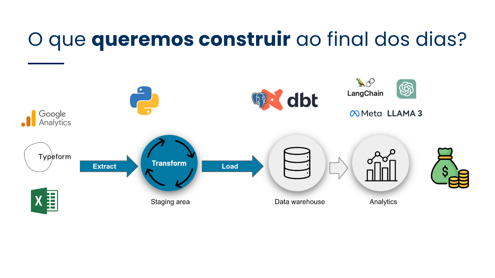

# Análise de Dados do Google Analytics

Este projeto consiste em dois scripts Python para extrair dados do Google Analytics de um banco de dados PostgreSQL e realizar análises usando a API da OpenAI.

## Visão Geral do Pipeline

[](https://youtube.com/live/INK-8RhEyrM)

Clique na imagem acima para assistir a um vídeo explicativo sobre o pipeline de análise de dados.

[](https://link.excalidraw.com/l/8pvW6zbNUnD/ABHZCoeTB1w)

Clique na imagem acima para visualizar o Excalidraw do projeto.

## Arquivos do Projeto


1. `sql_to_csv.py`: Extrai dados de uma tabela PostgreSQL e os salva em um arquivo CSV.
2. `teste_chatgpt.py`: Carrega os dados do CSV e realiza análises usando a API da OpenAI (GPT-3.5 Turbo).
3. `.env`: Arquivo de configuração contendo variáveis de ambiente (não incluído no repositório por segurança).

## Configuração

1. Crie um arquivo `.env` na raiz do projeto com as seguintes variáveis:

```
DATABASE_URL=sua_url_do_banco_de_dados
NOME_TABELA=nome_da_sua_tabela
OPENAI_API_KEY=sua_chave_api_da_openai
```

2. Instale as dependências necessárias:

```
pip install pandas python-dotenv sqlalchemy openai
```

## Como Executar

1. Execute o script `sql_to_csv.py` para extrair os dados do banco de dados e criar o arquivo CSV:

```
python sql_to_csv.py
```

2. Execute o script `teste_chatgpt.py` para realizar análises usando a API da OpenAI:

```
python teste_chatgpt.py
```

## Descrição dos Scripts

### sql_to_csv.py

Este script se conecta ao banco de dados PostgreSQL usando as credenciais fornecidas no arquivo `.env`, executa uma consulta SQL para selecionar todos os dados da tabela especificada e salva os resultados em um arquivo CSV.

### teste_chatgpt.py

Este script carrega os dados do arquivo CSV gerado pelo `sql_to_csv.py` e usa a API da OpenAI para realizar análises. Ele faz uma série de perguntas predefinidas sobre os dados e imprime as respostas geradas pelo modelo GPT-3.5 Turbo.

## Observações

- Certifique-se de manter suas credenciais e chaves de API seguras e não as compartilhe publicamente.
- O uso da API da OpenAI pode incorrer em custos. Verifique a precificação atual antes de executar o script `teste_chatgpt.py`